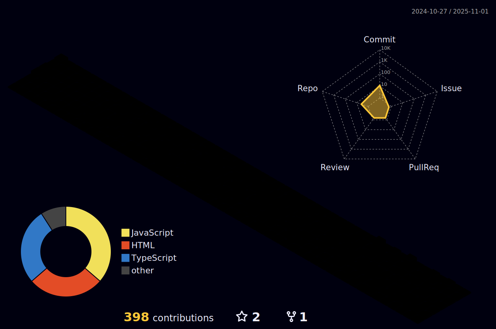

  <!--  -->
  
<h5 align="center">
  <code><a href="https://www.linkedin.com/in/carlos-giongo/" title="LinkedIn Profile"> LinkedIn</a></code>
  <code><a href="https://stackoverflow.com/users/18868039/carlos-giongo" title="Stack Overflow Profile"> Stack Overflow</a></code>
</h5>
 

  Olá! Me chamo Carlos Giongo, sou um estudante metido a desenvolvedor.
   
   
  🎓 Bacharel em Sistemas da informação pela UNOESC/Chapecó
   
  🎓 Graduado técnico em Desenvolvimento de Sistemas pelo SENAI/Chapecó
   
  💻 Apaixonado por tecnologias server-side.
   
  📫 Me chama para trocarmos uma ideia: <a href="mailto: contato@giongo.dev">contato@giongo.dev</a>
  
   
   
  Criador da <a href="https://github.com/Logic-Layer-Dev" title="Logic Layer Organization"> Logic Layer</a></code>

  Co-owner da <a href="https://oestagiario.dev/" title="Estagiário"> Estagiário</a></code>

  
 |  |  |  
 | ----------- | ----------- |

 
  

   

  

 
##
   

     
  

<!--

<h1 align="center">
  
</h1>

<h5 align="center">
  <code><a href="https://www.linkedin.com/in/carlos-giongo/" title="LinkedIn Profile"> LinkedIn</a></code>
  <code><a href="https://stackoverflow.com/users/18868039/carlos-giongo" title="Stack Overflow Profile"> Stack Overflow</a></code>
</h5>
 

  Olá! Me chamo Carlos Giongo, sou um estudante metido a desenvolvedor.
   
   
  🎓 Estou atualmente cursando Sistemas da informação na UNOESC/Chapecó
   
  🎓 Sou graduado técnico em Desenvolvimento de Sistemas pelo SENAI/Chapecó
   
  💻 Sou um adorador de tecnologias server-side e cada dia me desenvolvo mais na área.
   
  📫 Me chama para trocarmos uma ideia: <a href="mailto: contato@carlosgiongo.com.br">contato@giongo.dev</a>
  
   
   
  Criador da <a href="https://github.com/Logic-Layer-Dev" title="LinkedIn Profile"> Logic Layer</a></code>

<h2 align="center">🔥 Algumas coisas que eu sei 🔥</h2>
 

  <code></code>
  <code></code>
  <code></code>
  <code></code>
  <code></code>
  <code></code>
  <code></code>
  <code></code>
  <code></code>
  <code></code>
  <code></code>
  <code></code>
  <code></code>
  <code></code>
  <code></code>
  <code></code>
  <code></code>
  <code></code>
  <code></code>

<h2 align="center">⚡ Stats ⚡</h2>
 

  

    
  

   

    
  

          
  

 

    

        Um agradecimento especial ao <a href='https://github.com/zumrudu-anka' targer='_blank'>zumrudu-anka</a>, idealizador desse tema.
    

-->
